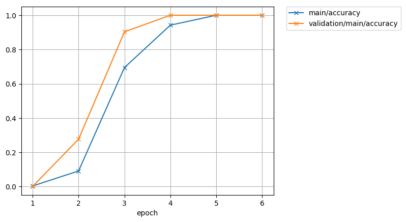
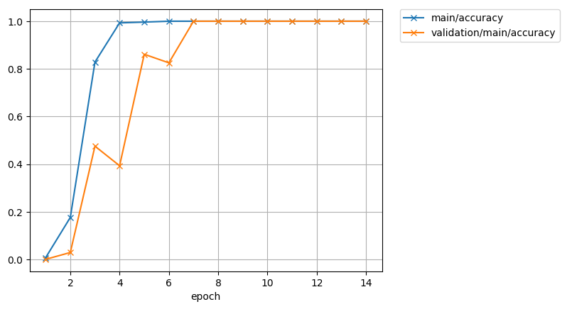

# Chainer CoordConv

This is Chainer implementation of [CoordConv](https://arxiv.org/abs/1807.03247)

# Requirments

- Chainer 4

# Example

```
python train.py --gpu 0
```




```
python train.py --gpu 0 --nouniform
```


